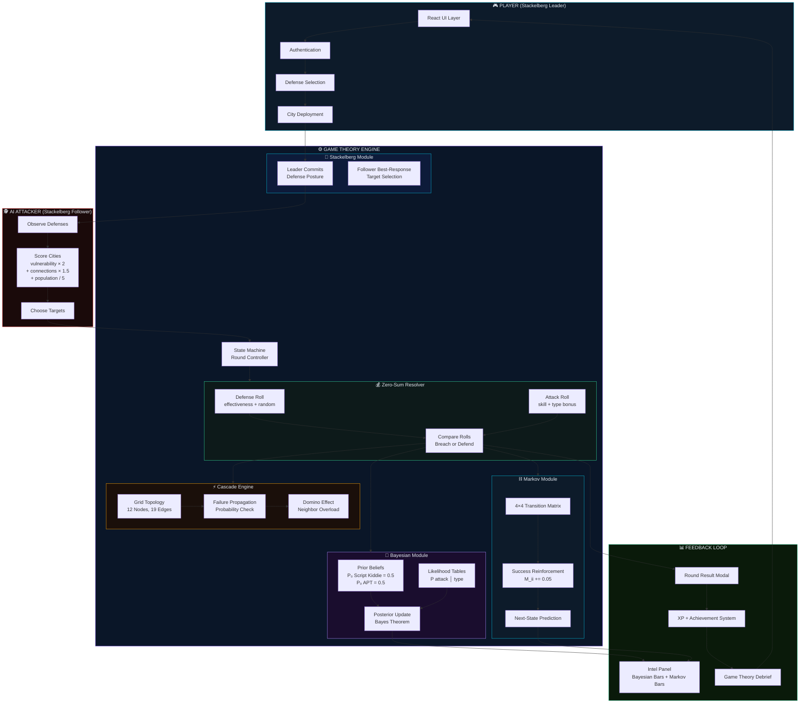
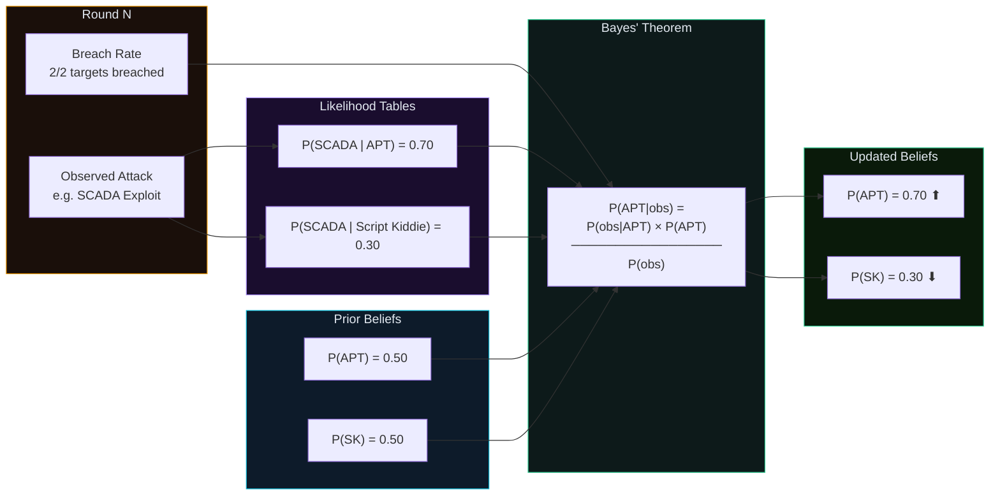
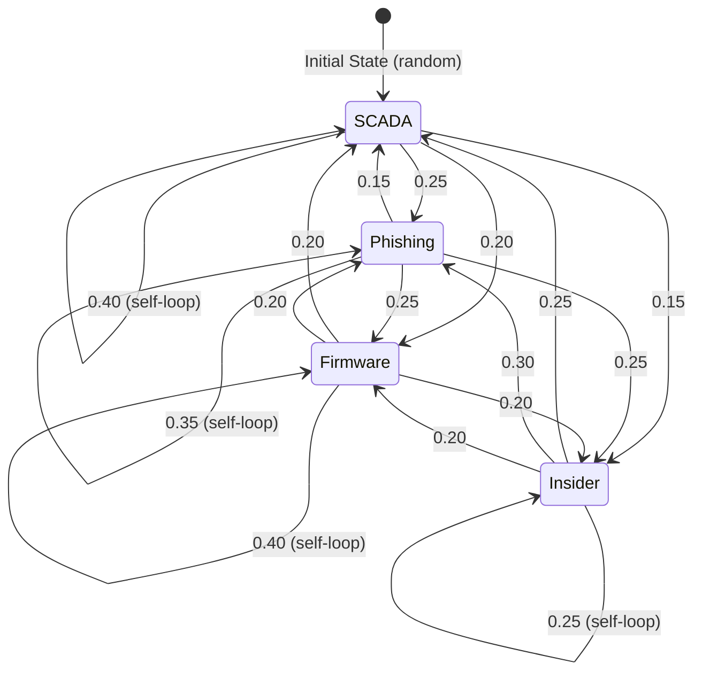
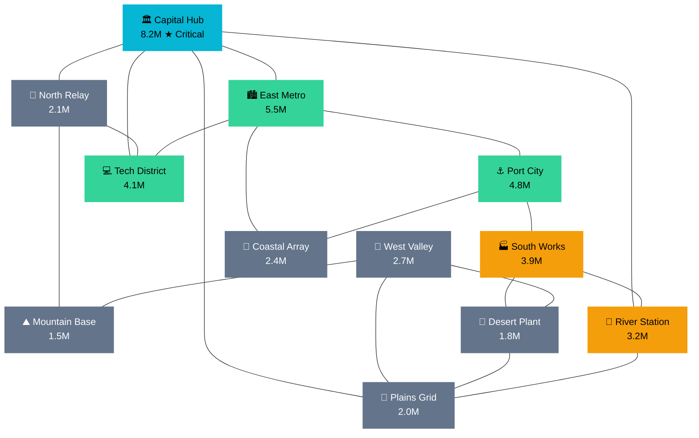
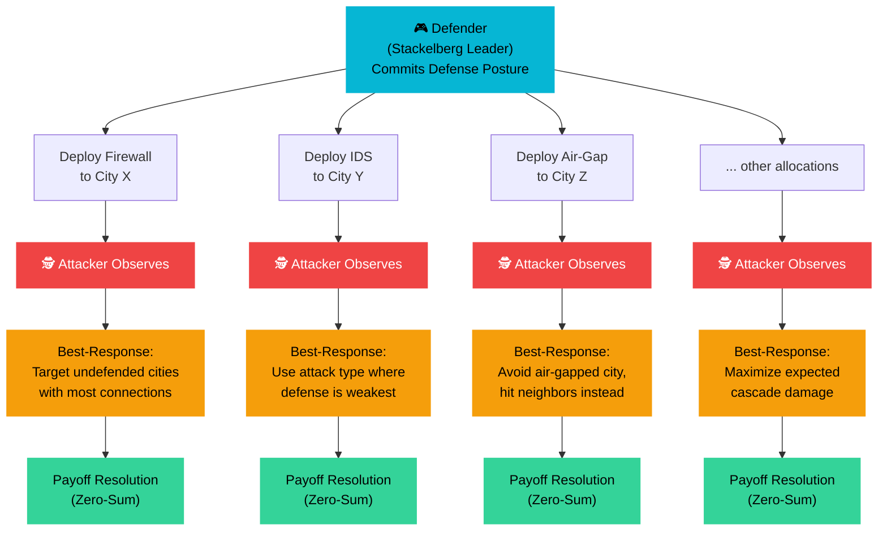

# ⚡ GRID WARS — Power Grid Cyber Defense Simulator

> A game-theory strategy game where you defend a national power grid against state-sponsored cyber attacks. Built with React + Vite.


---

## 📌 About

**GRID WARS** is an interactive strategy game that applies formal game theory to a real-world cybersecurity problem — **defending critical power infrastructure from nation-state attackers**.

You play as the **Chief Information Security Officer (CISO)** of a national power grid with 12 interconnected cities. A state-sponsored hacking group called **APT-VOLT** is attempting to cause **cascading blackouts** by compromising key substations. Your job: allocate limited defense resources using game-theoretic reasoning to survive 8 rounds of attacks.

### Why This Use Case?

Power grid cybersecurity is one of the most critical real-world challenges today. Events like the **2015 Ukraine power grid attack** and the **2003 Northeast Blackout** demonstrate how cascading failures in interconnected infrastructure can affect millions. This game models that exact scenario using formal mathematical frameworks.

---

## 🎮 How to Play

1. **Login** — Create your commander profile
2. **Choose Difficulty** — Recruit / Analyst / Director / Wartime CISO (each has different budgets, cascade risks, and XP multipliers)
3. **Deploy Defenses** — Select defense tools from the left panel, then tap any city on the grid map to deploy. Or tap a city first to see a popup with all available options.
4. **End Turn** — Hit "End Turn" and watch the attack unfold
5. **Read Intel** — The right panel shows live **Bayesian probability** of attacker type and **Markov chain predictions** for the next attack vector
6. **Survive 8 Rounds** — If too many cities go offline, cascading failures trigger game over

### First Time?
A **step-by-step tutorial** automatically triggers on your first game. You can also access the full guide from the navigation bar anytime.

---

## 📐 Game Theory Concepts

Every core mechanic is driven by a formal mathematical model:

### Stackelberg Leader-Follower Model
You (the Defender) are the **Stackelberg Leader** — you commit your defensive posture first, and it's publicly visible. The AI attacker acts as the **Follower**, observing your deployments and computing a **best-response** by targeting your weakest, most connected cities. This mirrors real cybersecurity where organizations publish compliance certifications (ISO 27001, SOC 2) that signal their security investments.

### Bayesian Nash Equilibrium
The attacker's type is **unknown** — they could be a low-skill Script Kiddie or a sophisticated APT Group. You start with a 50/50 prior belief. Each round, the game computes a **Bayesian posterior update** based on:
- The attack vector used (APTs favor SCADA exploits and insider threats; script kiddies prefer phishing)
- The attacker's success rate (APTs have higher breach probability)

The updated beliefs are displayed in real-time in the Intel panel.

### Markov Chain Strategy Evolution
The attacker's strategy transitions follow a **Discrete-Time Markov Chain**. After each round, the probability of switching attack vectors is governed by a transition matrix. **Successful attacks reinforce the current state** (the attacker is more likely to repeat what worked), creating learnable patterns. The Markov prediction panel shows transition probabilities for the next round.

### Zero-Sum Payoff Structure
Every city you defend is a loss for the attacker. Every breach is your loss. The game is strictly zero-sum — there is no cooperative equilibrium.

### Cascade Effects (Network Externalities)
The power grid has a real **graph topology** with edges representing transmission lines. When a city goes offline, its **undefended neighbors** face overload risk (cascade probability depends on difficulty). This models real-world cascading infrastructure failures where a single point of failure can take down an entire region.

---

## 🧬 Architecture — Game Theory Engine

### System Architecture



### Round Lifecycle — Game Theory Flow

```mermaid
sequenceDiagram
    participant P as 🎮 Player (Leader)
    participant E as ⚙️ Game Engine
    participant S as 📐 Stackelberg
    participant A as 🕵️ AI Attacker (Follower)
    participant B as 🧠 Bayesian Module
    participant M as ⛓ Markov Module
    participant C as ⚡ Cascade Engine

    rect rgb(13, 27, 42)
        Note over P,E: PHASE 1 — Stackelberg Commitment
        P->>E: Deploy defenses to cities
        E->>S: Lock defense posture (publicly visible)
        S-->>A: Attacker observes deployments
    end

    rect rgb(26, 10, 10)
        Note over A,M: PHASE 2 — Attacker Best-Response
        M->>A: Markov transition → select attack type
        A->>S: Score all cities (vulnerability + topology)
        S->>A: Return top-N weakest targets
        A->>E: Launch attack on selected cities
    end

    rect rgb(13, 26, 26)
        Note over E,C: PHASE 3 — Zero-Sum Resolution
        E->>E: Roll defense vs attack for each target
        E->>C: Pass breached cities
        C->>C: Check neighbors (cascade probability)
        C->>E: Return cascade victims
    end

    rect rgb(26, 13, 46)
        Note over B,M: PHASE 4 — Learning & Adaptation
        E->>B: Observed attack type + success rate
        B->>B: Bayes' theorem → update P(APT)
        E->>M: Attack outcome (success/fail)
        M->>M: Reinforce transition matrix
    end

    rect rgb(10, 26, 10)
        Note over P,E: PHASE 5 — Feedback & Next Round
        E->>P: Show result modal + theory explanation
        B-->>P: Updated Bayesian bars
        M-->>P: Updated Markov predictions
        E->>P: XP + achievements + score
        P->>E: Continue → next round (budget refresh)
    end
```



### Bayesian Update Flow



### Markov Chain — Attacker Strategy Evolution



> **Reinforcement rule:** When an attack type succeeds (breaches a city), `M[current][current] += 0.05` and the row is renormalized. This makes the attacker more likely to repeat successful strategies — creating exploitable patterns for observant players.

### Cascade Failure — Network Topology



> **Cascade rule:** When a city goes offline, each of its **undefended neighbors** has a probability (15%–45% depending on difficulty) of overloading and going dark too. Capital Hub (5 connections) and East Metro (4 connections) are the highest-risk cascade nodes — losing them without neighbor protection can trigger a domino chain.

### Stackelberg Decision Tree



---

## 🏗️ Project Structure

```
Gridwars-powergrid-cyber-defense/
├── node_modules/             # Dependencies (auto-generated)
├── public/                   # Static assets
├── src/
│   ├── assets/               # Images, icons, static resources
│   ├── App.css               # Global app styles
│   ├── App.jsx               # Main game component (all game logic)
│   ├── index.css             # Root-level styles
│   └── main.jsx              # React entry point
├── .gitignore                # Git ignore rules
├── eslint.config.js          # ESLint configuration
├── index.html                # HTML entry point
├── package-lock.json         # Dependency lock file
├── package.json              # Project metadata & scripts
├── README.md                 # This file
└── vite.config.js            # Vite bundler configuration
```

### Tech Stack

| Layer | Technology |
|-------|-----------|
| Bundler | Vite 5 |
| Frontend | React 18 (Functional Components + Hooks) |
| Animations | Hand-crafted SVG with frame-based animation |
| Styling | CSS-in-JS (co-located styles) |
| Game Engine | Custom state machine (Bayesian + Markov + Stackelberg) |
| Fonts | DM Sans + Sora (Google Fonts) |
| Linting | ESLint |

---

## ✨ Features

### 🎮 Gaming Platform UX
- Full authentication flow (login / signup)
- Sticky navigation bar with back buttons on every screen
- Smooth page transitions with fade animations
- Responsive layout

### ⚔️ Gameplay
- 12 interconnected cities with real grid topology
- 6 defense strategies with attack-type effectiveness matrices
- 4 difficulty levels with XP multipliers
- City popup defense selector (tap city → choose from menu)
- Auto-triggering beginner tutorial (5-step guided walkthrough)
- Dedicated guide page accessible anytime

### 🔥 Retention & Engagement
- XP and leveling system
- 6 unlockable achievements with confetti celebrations
- Win streak tracking
- Daily challenge banner
- Global leaderboard
- Player profile with lifetime stats
- Toast notifications for instant feedback on every action

### 📊 Game Theory Visualization
- Live Bayesian probability bars (Script Kiddie vs APT)
- Markov chain next-attack prediction bars
- Post-round theory explainers in result modal
- End-of-game debrief connecting outcomes to Stackelberg, Bayesian, and Markov concepts

---

## 🚀 Getting Started

### Prerequisites
- [Node.js](https://nodejs.org/) (v18 or above)
- npm (comes with Node.js)

### Installation

```bash
# Clone the repository
git clone https://github.com/Subhitcha04/Gridwars-powergrid-cyber-defense.git

# Navigate into the project
cd Gridwars-powergrid-cyber-defense

# Install dependencies
npm install

# Start the development server
npm run dev
```

App opens at `http://localhost:5173`

### Build for Production

```bash
npm run build
```

Output goes to the `dist/` folder — deploy it anywhere (Vercel, Netlify, GitHub Pages).

---

## 🧪 Mathematical Models

### Bayesian Update (each round)

```
P(APT | observed_attack) = [ P(attack | APT) × P_prior(APT) ] / P(attack)
```

Where:
- `P(attack | APT)` = likelihood table per attack vector (SCADA: 0.7, Phishing: 0.2, Firmware: 0.6, Insider: 0.8)
- `P(attack | ScriptKiddie)` = (SCADA: 0.3, Phishing: 0.8, Firmware: 0.4, Insider: 0.2)
- Success rate provides an additional signal (APTs breach more often)

### Markov Transition Matrix

```
        SCADA  PHISH  FIRMWARE  INSIDER
SCADA   [0.40   0.25    0.20     0.15]
PHISH   [0.15   0.35    0.25     0.25]
FIRM    [0.20   0.20    0.40     0.20]
INSID   [0.25   0.30    0.20     0.25]
```

Reinforcement: On successful breach, `M[i][i] += 0.05` with row renormalization.

### Stackelberg Best-Response (Attacker Target Selection)

```
score(city) = vulnerability × 2 + connections × 1.5 + population/5 + critical_bonus + ε
```

Where:
- `vulnerability = 5 - defense_effectiveness[attack_type]`
- `connections` = number of online neighbors (cascade potential)
- `ε ~ U(0, (1 - skill) × 3)` — noise decreases with attacker skill

---

## 🎯 Difficulty Levels

| Difficulty | Budget | Cascade Risk | Targets/Round | Blackout Threshold | XP Multiplier |
|-----------|--------|-------------|---------------|-------------------|---------------|
| Recruit | $120K | 15% | 1 | 8 cities | 1x |
| Analyst | $100K | 25% | 2 | 6 cities | 1.5x |
| Director | $75K | 35% | 2 | 5 cities | 2x |
| Wartime CISO | $55K | 45% | 3 | 4 cities | 3x |

---

## 🏆 Achievements

| Achievement | Requirement | XP |
|------------|-------------|-----|
| First Blood | Survive your first round | +50 |
| Untouchable | Repel all attacks in a round | +100 |
| Chain Breaker | Prevent a cascade failure | +150 |
| Mind Reader | Correctly predict 3 attacks | +200 |
| Efficient Ops | Win with 30%+ budget remaining | +250 |
| Grid Guardian | Win with all 12 cities online | +300 |

---

---

## 📚 References

- Tambe, M. (2011). *Security Games: Applying Game Theory to Counterterrorism*. Stackelberg security game formulation.
- Harsanyi, J.C. (1967). *Games with Incomplete Information*. Bayesian game framework.
- NERC CIP Standards — North American Electric Reliability Corporation Critical Infrastructure Protection.
- 2015 Ukraine Power Grid Attack — First confirmed cyber attack on a power grid.
- 2003 Northeast Blackout — Cascading failure affecting 55 million people across US and Canada.

---

## 📄 License

This project is developed for academic purposes as part of a **Game Theory & Decision Analysis** course.
